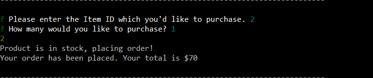
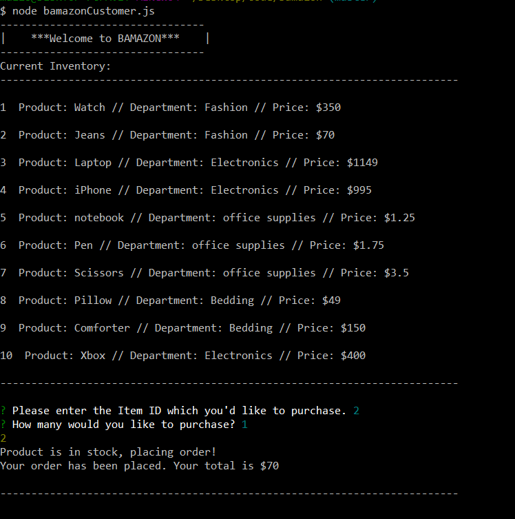
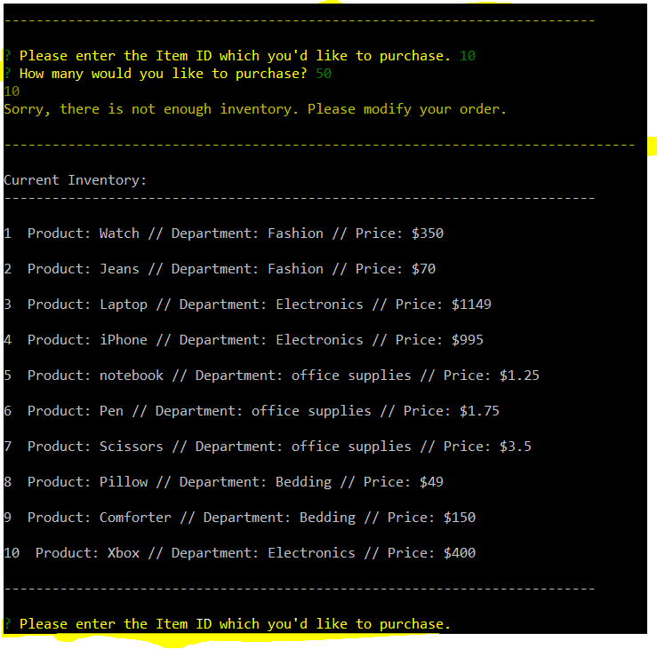

# bamazon

The bamazon app is a simple app meant to mimic the basic functionality of a database like Amazon. In this node app you will be shown a table with products. You will then be prompted to enter the ID number of the product you'd like to purchase, and the quantity. 

If there is  enough quantity you will be given a success message and total for your purchase. However if there is not enough quantity you will be prompted to reenter your order. 

This is an example of the text area where you will enter your purchase.

This is an example of what a successful purchase looks like. 

And this is an expample of an unsuccessful purchase where you are prompted to try again. The prompts are highlighted in yellow

This app is maintained by Caleb Colon

Please reach out to ccolon105@yahoo.com with any questions. 